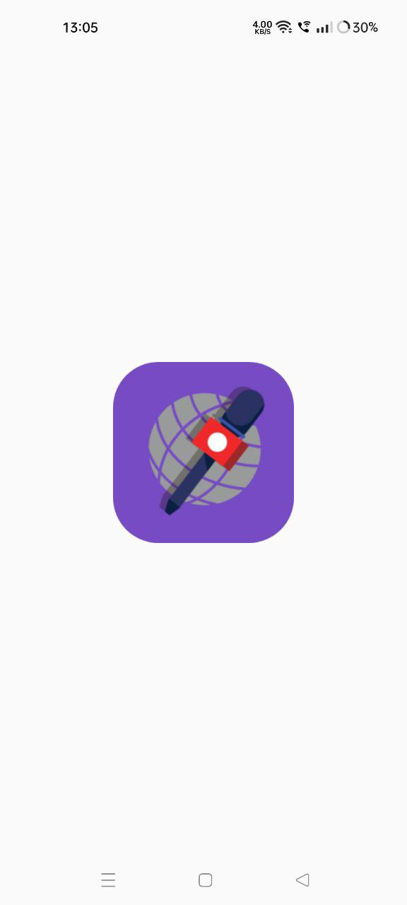
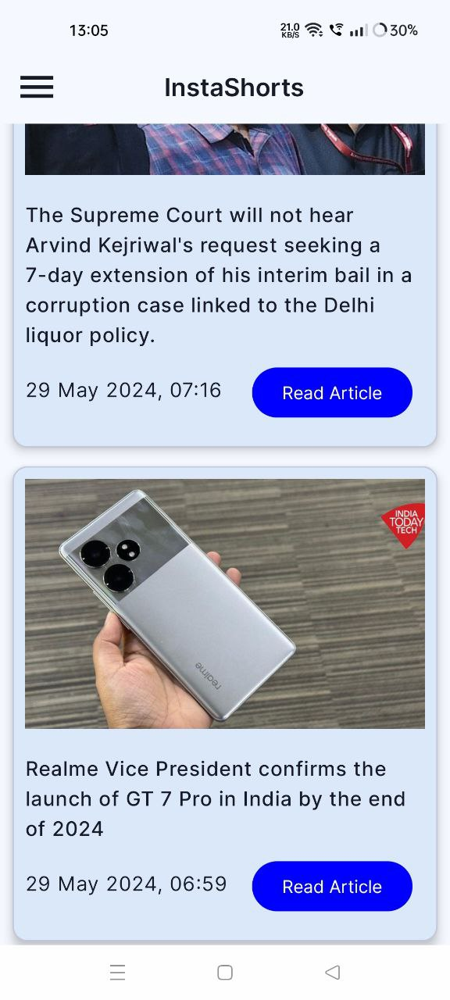
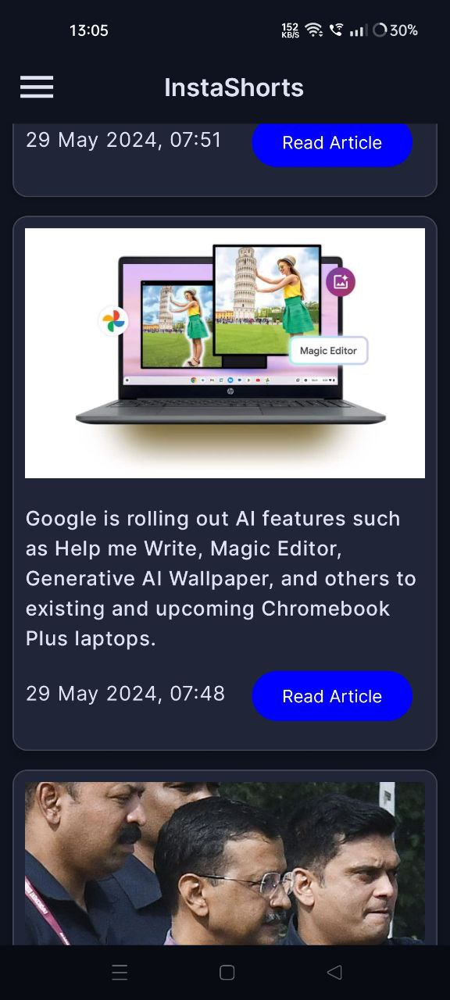
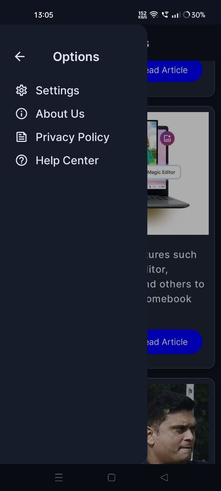
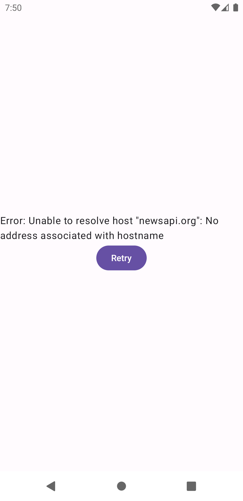

# InstaShorts

InstaShorts is your ultimate news companion, offering quick and concise updates on the latest headlines from around the world. 
Stay informed effortlessly with InstaShorts, where global news is just a tap away.

## Features

- **Latest Headlines:** Get instant access to the most recent news stories from various sources worldwide.
- **Short Descriptions:** Each headline is accompanied by a brief summary for quick understanding.
- **Read More Button:** Dive deeper into any news story with the "Read More" button, which takes you to the respective news agency's website for the full article.
- **Sleek Interface:** Enjoy a user-friendly interface designed for seamless news browsing.

## Screenshots

  
    
 

## Download

You can download the latest version of InstaShorts from the following link:

[Download InstaShorts APK](https://github.com/Shams66789/InstaShorts/raw/main/APK/InstaShorts.apk)

## Installation Guide

1. Download the InstaShorts APK file from the link provided above.
2. Open the APK file on your Android device.
3. Follow the on-screen instructions to install the app.
4. Once installed, launch InstaShorts and start browsing the latest headlines!

## Permission

- This App automatically take permission for Internet.

**Disclaimer**: InstaShorts does not own or publish any news content. All news articles are sourced from third-party news agencies.